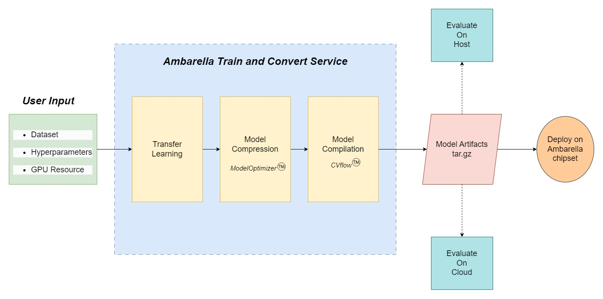

# Ambarella Model Garden - YOLO based Object Detection

## Introduction

Ambarella’s Model Garden is a collection of models tuned for Ambarella's chipsets for ease of deployment. Users can select the domain and choose from one of the offered models based on their real world application. 

Every model undergoes transfer learning to adapt to user's dataset and then is further optimized using Ambarella's proprietary model compression toolkit to enhance the performance on Ambarella's devices. Users are provided with optimization knobs that influence the trained model's accuracy and performance. Finally, the CVflow SDK compiles the trained model, generating an artifacts tar file containing compiled binaries that can be used to run on the device without any extra code. 

This repo consists of an object detection use case using YOLOv5

## Usage

### AWS

The YOLOv5 model is hosted on AWS using SageMaker product. SageMaker Algorithm allows for training and inference on the cloud. The optimized YOLOv5 docker image is hosted on AWS ECR which is used internally by the SageMaker training and inference. Here is the link to the SageMaker Algorithm on the AWS Marketplace: [YOLOv5](https://aws.amazon.com/marketplace/pp/prodview-zf6dvvlikubbu)

#### Prerequisites

Users must have access to AWS products like SageMaker, S3 with appropriate IAM role. 

#### Training

AWS SageMaker is the driver for training the algorithm. Users can subscribe to the latest version of the algorithm from the Marketplace page. The subscribed algorithm will show up in the SageMaker Console. 

Once subscribed, please refer to the Algorithm ARN in the Algorithms: My Subscriptions => View subscription details => Algorithms for training, tuning and inference specifications.

There are 2 ways of training and preparing the model: 

1. Using the SageMaker console

    a. Find the subscribed algorithm: SageMaker -> Training -> Algorithms -> AWS Marketplace subscriptions -> YOLOv5 based Object Detection

    b. Click on the algorithm and then click on Actions followed by `Create Training Job` 

    c. Provide the following: 
    
        i.   Job name: 
                Training Job name

        ii.  Resource Configuration: 
                Type of Resource. Please select GPU based instances such as G4, G5, P2, P3, P4. Enter ~50GB in the `Additional storage volume per instance (GB)` section. This depends on the user's dataset.

        iii. Hyperparameters: 
                Enter the values for the hyperparameters. Most of the values are enabled as default. Please refer to the products page on Marketplace for more details on the hyperparameters.
        
        iv.  Input Data Configuration:
                The channel name is dataset. The data source supported is S3. Please provide path to S3 bucket which points to the dataset folder as mentioned in the above dataset section. Please refer to the specific model's `prepare_dataset.md` documentation for instructions on preparing the dataset.

        v.   Output data Configuration:
                The output of the service will be tar'd and saved in the S3 location specified by the user. 

    d. Click on Create Training Job and select the Job Name under Training -> Training Jobs. Once clicked, the UI shows the summary of the user's inputs.  SageMaker UI also provides CloudMetrics services for tracking Instance Resources and Algorithm metrics (mAP) real time along with Logs. 

    e. Once training job is completed, the tar'd model artifacts will be present in the S3 location provided by the user. 

2. Using the SageMaker Python API's. 

    Please refer to sample notebook of any model that demonstrates usage of API's. [Sample Notebook](https://github.com/Ambarella-Inc/AmbaModelGarden/blob/8192442208781c0069238ff4b362ffcf54b3479a/object_detection/yolov5/sample.ipynb)

#### Cloud Evaluation

Each Marketplace product also provides support to running inference on the cloud using SageMaker services. Once the model training has been completed, users can create EndPoints under SageMaker -> Inference -> Endpoints. More information can be found here [Deploying Models for Inference](https://docs.aws.amazon.com/sagemaker/latest/dg/deploy-model.html)

Cloud evaluation can also be done using SageMaker's Python API's. Please refer to the same notebook which demonstrates the usage of the API's. 

### Container

With license agreement with Ambarella, users can get access to the same container publised to AWS ECR and can either modify the existing model or add a custom model using the APIs provided. 

## On Device 

The tests/ folder provides guidelines on how to use the output training artifacts and run the end application on the device. 
